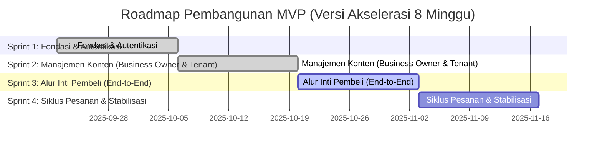

### **Roadmap & Timeline MVP: Aplikasi Kantin Multi-Tenant (8 Minggu)**

**Total Estimasi Durasi MVP:** 4 Sprints (8 Minggu)
**Backend Platform:** Appwrite (atau BaaS sejenis)

#### **Gantt Chart Visualisasi Sprint**

---

### **Checklist Detail per Sprint (Revisi dengan Appwrite)**

#### **Sprint 1: Fondasi & Autentikasi (Minggu 1-2)**
**Tujuan Sprint:** Menyiapkan infrastruktur Appwrite dan mengimplementasikan alur login yang fungsional untuk peran Business Owner dan Tenant.

*   **[x] [Umum]** Setup proyek Git dan CI/CD dasar.
*   **[x] [Appwrite]** Setup proyek di Appwrite Cloud (atau self-host).
*   **[x] [Appwrite]** Buat koleksi database inti: `tenants`, `categories`, `products`, `orders`.
*   **[x] [Appwrite]** Konfigurasi Appwrite Authentication dan buat peran kustom (`business-owner`, `tenant`).
*   **[x] [Appwrite]** Definisikan alur onboarding untuk `Business Owner` (MVP: Pembuatan akun manual oleh System Admin via Appwrite Console).
*   **[x] [Front-end]** Setup proyek Flutter, arsitektur, dependensi, routing (`GoRouter`), dan integrasikan **Appwrite SDK**.
*   **[x] [Front-end]** Buat UI untuk halaman Login (untuk `Business Owner` dan `Tenant`).
*   **[x] [Front-end]** Integrasikan UI dengan **Appwrite Authentication** (login, logout, session management).
*   **[x] [Front-end]** Implementasikan pengalihan rute berdasarkan status login dan peran dari Appwrite.

---

#### **Sprint 2: Manajemen Konten (Business Owner & Tenant) (Minggu 3-4)**
**Tujuan Sprint:** Memberikan kemampuan kepada `Business Owner` untuk membuat tenant, dan `Tenant` untuk mengisi menu mereka.

*   **[ ] [Appwrite]** Buat **Appwrite Function** untuk `createTenant` yang secara otomatis membuat user baru dan data tenant.
*   **[ ] [Appwrite]** Atur izin koleksi `categories` agar hanya bisa diakses oleh peran `business-owner`.
*   **[ ] [Appwrite]** Atur izin (document-level) pada koleksi `products` agar hanya bisa di-CRUD oleh `tenant` yang bersangkutan.
*   **[ ] [Front-end]** Buat UI Dasbor `Business Owner` untuk memanggil fungsi `createTenant` dan mengelola `categories`.
*   **[ ] [Front-end]** Integrasikan UI `Business Owner` dengan Appwrite Functions dan Database.
*   **[ ] [Front-end]** Buat UI Dasbor `Tenant` untuk mengelola `products` (Tambah/Edit/Hapus & toggle ketersediaan).
*   **[ ] [Front-end]** Integrasikan UI `Tenant` dengan Appwrite Database.

---

#### **Sprint 3: Alur Inti Pembeli (End-to-End) (Minggu 5-6)**
**Tujuan Sprint:** Pembeli dapat melakukan alur pemesanan tanpa login, mulai dari scan QR hingga berhasil membuat pesanan.

*   **[ ] [Appwrite]** Atur izin koleksi `tenants` dan `products` agar dapat dibaca oleh **pengguna anonim (publik)**.
*   **[ ] [Appwrite]** Buat **Appwrite Function** `createOrder` untuk memproses data dari keranjang belanja menjadi dokumen pesanan baru.
*   **[ ] [Front-end]** Buat UI Halaman Menu Tenant (diakses via QR code).
*   **[ ] [Front-end]** Implementasikan fungsi "Tambah ke Keranjang" menggunakan state management (Riverpod).
*   **[ ] [Front-end]** Buat UI Halaman Keranjang Belanja dan Checkout.
*   **[ ] [Front-end]** Integrasikan alur checkout dengan memanggil Appwrite Function `createOrder`.
*   **[ ] [Front-end]** Arahkan ke halaman "Sukses" atau halaman pelacakan pesanan (statis untuk saat ini).

---

#### **Sprint 4: Siklus Pesanan & Stabilisasi (Minggu 7-8)**
**Tujuan Sprint:** Menutup siklus pesanan, memastikan Tenant dapat memprosesnya, dan Pembeli mendapat update status.

*   **[ ] [Appwrite]** Buat **Appwrite Function** `updateOrderStatus` untuk digunakan oleh Tenant.
*   **[ ] [Appwrite]** Konfigurasi **Appwrite Realtime** pada koleksi `orders` untuk live-update status pesanan.
*   **[ ] [Appwrite]** Atur izin baca pada koleksi `orders` (Tenant hanya melihat pesanan miliknya, Pembeli anonim melacak via ID pesanan).
*   **[ ] [Front-end]** Buat UI "Manajemen Pesanan" untuk Tenant, yang listen ke update **realtime** dari Appwrite.
*   **[ ] [Front-end]** Buat UI "Lacak Pesanan" untuk Pembeli, yang juga listen ke update **realtime**.
*   **[ ] [Front-end]** (Opsional) Integrasikan dengan notifikasi dasar saat status pesanan berubah.
*   **[ ] [Umum]** Lakukan **smoke testing** di seluruh alur aplikasi.
*   **[ ] [Umum]** Prioritaskan dan perbaiki **bug pemblokir (blocker bugs)**.
*   **[ ] [Umum]** Siapkan build aplikasi untuk demonstrasi.

---

### **Risiko & Kompromi dalam Timeline 8 Minggu**

*   **Minim Polish:** Aplikasi akan fungsional tetapi mungkin terasa kasar. Tidak akan ada waktu untuk animasi, transisi yang mulus, atau penyempurnaan UI/UX yang mendalam.
*   **Pengujian Terbatas:** Pengujian akan difokuskan pada "happy path" (alur normal). Waktu untuk pengujian kasus-kasus pinggiran (edge cases) dan UAT formal akan sangat terbatas.
*   **Ketergantungan pada BaaS:** Kecepatan dan keandalan aplikasi akan bergantung pada layanan Appwrite. Perlu pemahaman tentang batasan (limit) platform yang digunakan.
*   **Logika Kompleks di Functions:** Logika bisnis yang kompleks perlu diimplementasikan dalam Appwrite Functions, yang mungkin memiliki lingkungan dan batasan tersendiri.

Timeline ini memungkinkan Anda memiliki produk yang berfungsi di akhir minggu ke-8, yang dapat didemonstrasikan dan digunakan untuk mendapatkan umpan balik awal.