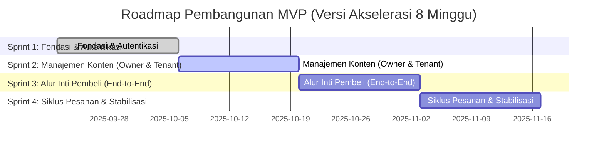

### **Roadmap & Timeline MVP: Aplikasi Kantin Multi-Tenant (8 Minggu)**

**Total Estimasi Durasi MVP:** 4 Sprints (8 Minggu)

#### **Gantt Chart Visualisasi Sprint**

---

### **Checklist Detail per Sprint**

#### **Sprint 1: Fondasi & Autentikasi (Minggu 1-2)**
**Tujuan Sprint:** Menyiapkan proyek dan mengimplementasikan alur login/registrasi yang fungsional untuk semua peran.

*   **[ ] [Umum]** Setup proyek Git, CI/CD dasar, dan kontrak API untuk sprint ini.
*   **[ ] [Back-end]** Implementasikan skema database inti (`users`, `tenants`, `categories`, `products`).
*   **[ ] [Back-end]** Bangun endpoint untuk registrasi (Pembeli) dan login (semua peran) menggunakan JWT.
*   **[ ] [Back-end]** Buat *middleware* otorisasi berbasis peran.
*   **[ ] [Front-end]** Setup proyek Flutter dengan arsitektur, dependensi, dan routing (`GoRouter`).
*   **[ ] [Front-end]** Buat UI untuk halaman Login dan Registrasi.
*   **[ ] [Front-end]** Integrasikan UI dengan API autentikasi dan kelola state sesi pengguna (menggunakan Riverpod).
*   **[ ] [Front-end]** Implementasikan pengalihan rute berdasarkan status login dan peran.

---

#### **Sprint 2: Manajemen Konten (Owner & Tenant) (Minggu 3-4)**
**Tujuan Sprint:** Memberikan kemampuan kepada Owner untuk membuat tenant, dan Tenant untuk mengisi menu mereka. Sprint ini menggabungkan dua peran "penjual".

*   **[ ] [Back-end]** Implementasikan endpoint untuk Owner: `POST /tenants`.
*   **[ ] [Back-end]** Implementasikan endpoint CRUD untuk Kategori Makanan (hanya Owner).
*   **[ ] [Back-end]** Implementasikan endpoint CRUD untuk Produk (hanya Tenant).
*   **[ ] [Front-end]** Buat UI **minimalis** untuk Dasbor Owner yang berisi fungsi "Tambah Tenant" dan "Kelola Kategori".
*   **[ ] [Front-end]** Integrasikan UI Owner dengan API yang relevan.
*   **[ ] [Front-end]** Buat UI **minimalis** untuk Dasbor Tenant yang berisi fungsi "Tambah/Edit/Hapus Produk".
*   **[ ] [Front-end]** Integrasikan UI Tenant dengan API produk, termasuk *toggle* ketersediaan.

---

#### **Sprint 3: Alur Inti Pembeli (End-to-End) (Minggu 5-6)**
**Tujuan Sprint:** Pembeli dapat melakukan seluruh alur pemesanan, mulai dari melihat menu hingga berhasil membuat pesanan. Ini adalah sprint paling krusial.

*   **[ ] [Back-end]** Implementasikan endpoint publik untuk melihat daftar tenant dan menu produk.
*   **[ ] [Back-end]** Implementasikan endpoint `POST /orders` yang transaksional.
*   **[ ] [Front-end]** Buat UI untuk Halaman Utama (daftar tenant) dan Halaman Detail Tenant (menu).
*   **[ ] [Front-end]** Implementasikan fungsi "Tambah ke Keranjang". Untuk mempercepat, **opsi 1:** gunakan state management (Riverpod) saja tanpa persistensi lokal. **Opsi 2 (jika waktu cukup):** implementasi dasar dengan Drift.
*   **[ ] [Front-end]** Buat UI Halaman Keranjang Belanja dan Checkout.
*   **[ ] [Front-end]** Integrasikan alur checkout dengan API `POST /orders`.
*   **[ ] [Front-end]** Arahkan ke halaman "Sukses" atau halaman pelacakan pesanan (statis untuk saat ini).

---

#### **Sprint 4: Siklus Pesanan & Stabilisasi (Minggu 7-8)**
**Tujuan Sprint:** Menutup siklus pesanan, memastikan Tenant dapat memprosesnya, dan menstabilkan aplikasi untuk rilis MVP.

*   **[ ] [Back-end]** Implementasikan endpoint `PUT /orders/{id}/status` untuk Tenant.
*   **[ ] [Back-end]** Implementasikan endpoint `GET /orders` untuk Tenant dan Pembeli.
*   **[ ] [Back-end]** Implementasikan fungsionalitas notifikasi dasar (FCM) saat status pesanan kunci berubah (misal: "Siap Diambil").
*   **[ ] [Front-end]** Buat UI "Manajemen Pesanan" untuk Tenant.
*   **[ ] [Front-end]** Buat UI "Lacak Pesanan" untuk Pembeli.
*   **[ ] [Front-end]** Integrasikan kedua halaman di atas dengan API yang relevan.
*   **[ ] [Umum]** Lakukan **pengujian internal cepat (smoke testing)** di seluruh alur aplikasi.
*   **[ ] [Umum]** Prioritaskan dan perbaiki **bug pemblokir (blocker bugs)** saja.
*   **[ ] [Umum]** Siapkan build aplikasi untuk demonstrasi atau rilis internal.

---

### **Risiko & Kompromi dalam Timeline 8 Minggu**

*   **Minim Polish:** Aplikasi akan fungsional tetapi mungkin terasa kasar. Tidak akan ada waktu untuk animasi, transisi yang mulus, atau penyempurnaan UI/UX yang mendalam.
*   **Pengujian Terbatas:** Pengujian akan difokuskan pada "happy path" (alur normal). Waktu untuk pengujian kasus-kasus pinggiran (edge cases) dan UAT formal akan sangat terbatas.
*   **Potensi Utang Teknis (Technical Debt):** Beberapa solusi mungkin akan diambil secara pragmatis untuk mengejar waktu, yang mungkin perlu diperbaiki (refactoring) di masa mendatang.
*   **Ketergantungan Tinggi:** Tim front-end dan back-end harus bekerja dengan sangat sinkron. Keterlambatan di satu sisi akan secara langsung berdampak besar pada sisi lainnya.
