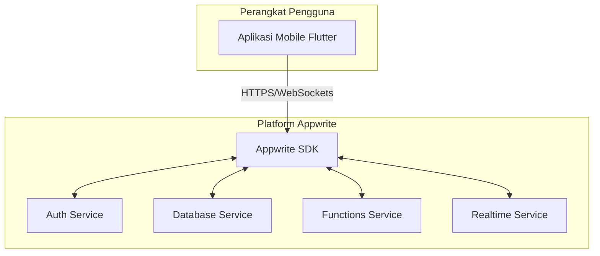

### **Dokumen Desain Perangkat Lunak (SDD): Aplikasi Tenant QR-Order**

*   **Versi:** 1.1
*   **Tanggal:** 31 Oktober 2025
*   **Status:** Revisi
*   **Penyusun:** Gemini

---

### **1. Pendahuluan**

#### **1.1 Tujuan**
Dokumen ini menyediakan desain teknis yang komprehensif untuk Aplikasi Tenant QR-Order. Tujuannya adalah untuk memberikan cetak biru (blueprint) arsitektural dan desain tingkat komponen kepada tim pengembang. Dokumen ini menerjemahkan kebutuhan dari **PRD** dan **Ceklist Iterasi** ke dalam spesifikasi teknis yang berpusat pada penggunaan **Appwrite** sebagai platform backend.

#### **1.2 Ruang Lingkup**
Desain ini mencakup dua komponen utama:
1.  **Aplikasi Klien (Mobile App):** Arsitektur, manajemen state, dan desain UI untuk aplikasi Flutter.
2.  **Platform Backend (Appwrite):** Konfigurasi layanan Appwrite yang mencakup autentikasi, database, functions (logika server), dan realtime.

---

### **2. Arsitektur Sistem Tingkat Tinggi (High-Level)**

Sistem ini akan mengadopsi arsitektur **Klien-BaaS (Backend as a Service)**, yang meminimalkan pengembangan sisi server secara manual.

*   **Aplikasi Klien (Flutter):** Bertanggung jawab penuh untuk presentasi (UI) dan interaksi pengguna. Berkomunikasi langsung dengan Appwrite melalui SDK resmi.
*   **Platform Appwrite:** Bertindak sebagai backend terkelola yang menyediakan layanan siap pakai:
    *   **Auth:** Mengelola pengguna, peran (roles), dan sesi.
    *   **Database:** Menyimpan semua data aplikasi dalam bentuk koleksi dokumen NoSQL.
    *   **Functions:** Menjalankan logika bisnis sisi server yang aman (misalnya, membuat pesanan).
    *   **Realtime:** Mengirim pembaruan data secara langsung ke klien saat ada perubahan.

---

### **3. Desain Aplikasi Klien (Front-end - Flutter)**

#### **3.1 Arsitektur: Clean Architecture**
Aplikasi tetap distrukturkan mengikuti prinsip **Clean Architecture** untuk memisahkan logika bisnis dari detail implementasi.

*   **Presentation Layer:** UI (Widgets), Manajemen State (**Riverpod**), dan Navigasi (**GoRouter**).
*   **Domain Layer:** Entitas (**Freezed**), Use Cases, dan Abstraksi Repository.
*   **Data Layer:** Implementasi Repository yang berinteraksi dengan dua sumber data:
    *   **Remote Data Source:** Menggunakan **Appwrite SDK** untuk semua komunikasi dengan backend.
    *   **Local Data Source:** Menggunakan **Drift (SQLite)** untuk caching dan manajemen keranjang belanja offline.

#### **3.2 Struktur Direktori Proyek**
Struktur direktori tetap diorganisir berdasarkan fitur dan lapisan untuk menjaga skalabilitas.

#### **3.3 Strategi Manajemen State (Riverpod)**
*   **`FutureProvider`:** Untuk mengambil data inisial dari Appwrite (misal: detail tenant, daftar kategori).
*   **`StreamProvider`:** Tulang punggung untuk fitur realtime. Akan *listen* ke stream dari **Appwrite Realtime** untuk memantau status pesanan dan daftar pesanan baru.
*   **`NotifierProvider`:** Untuk mengelola state interaktif seperti form dan keranjang belanja.
*   **`Provider`:** Untuk menyediakan instance Appwrite Client dan Repository.

---

### **4. Desain Backend (Appwrite)**

#### **4.1 Manajemen Peran & Izin (Roles & Permissions)**
Sistem akan memiliki 4 tingkat akses yang dikelola oleh Appwrite Auth & Database Permissions untuk mendukung model bisnis Anda.

| Peran | Deskripsi | Lingkup & Contoh | Hak Akses Utama |
| :--- | :--- | :--- | :--- |
| **System Admin** | **Pemilik Aplikasi (Anda)**. | Mengelola seluruh platform melalui **Appwrite Console**. | Akses penuh ke semua data, pengguna, dan konfigurasi. Peran ini tidak memiliki UI di aplikasi klien. |
| **Business Owner** | **Klien Anda** (yang membeli/berlangganan sistem). | **Multi-Tenant:** Pemilik ruko/rest area. **Single-Tenant:** Pemilik kafe/resto tunggal. | Mengelola langganan, membuat dan mengelola akun `Tenant`, dan melihat laporan gabungan dari semua tenant miliknya. |
| **Tenant** | **Penyewa/Staf Operasional**. Dikelola oleh `Business Owner`. | Warung di dalam ruko, atau staf di sebuah kafe. | **CRUD** pada koleksi `products` dan **Update** pada koleksi `orders` yang terkait dengan tenant mereka. |
| **Guest/Public** | **Pelanggan Akhir**. | Pengunjung yang memindai QR untuk memesan. | **Read-only** pada menu. Dapat membuat pesanan baru melalui `createOrder` function. |

**Catatan Implementasi:**
*   Untuk kasus **Single-Tenant** (pemilik kafe), saat seorang `Business Owner` mendaftar, sistem akan secara otomatis membuat satu entitas `Tenant` yang terhubung dengannya. UI kemudian dapat disederhanakan agar `Business Owner` bisa langsung mengelola menunya seolah-olah mereka adalah `Tenant`.
*   Model ini memisahkan dengan jelas antara administrasi platform (oleh Anda) dan administrasi bisnis (oleh klien Anda).

#### **4.2 Appwrite Functions (Logika Sisi Server)**
Fungsi-fungsi ini penting untuk menjalankan operasi yang memerlukan keamanan atau logika terpusat.

| Fungsi | Deskripsi | Trigger |
| :--- | :--- | :--- |
| `createTenant` | Dijalankan oleh Owner. Membuat user baru untuk tenant, membuat dokumen tenant, dan men-generate QR code URL. | Panggilan API dari Klien |
| `createOrder` | Dijalankan oleh Pelanggan. Memvalidasi item keranjang dan membuat dokumen baru di koleksi `orders`. | Panggilan API dari Klien |
| `updateOrderStatus`| Dijalankan oleh Tenant. Mengubah status sebuah pesanan (misal: 'diproses', 'siap diambil'). | Panggilan API dari Klien |

#### **4.3 Fitur Tambahan yang Didukung Appwrite**
*   **QR Code Generation:** Saat `createTenant` dijalankan, function akan menghasilkan URL unik (misal: `https://app.com/tenant/{tenantId}`). URL ini kemudian diubah menjadi QR code di sisi klien untuk dicetak.
*   **Notifikasi Realtime:** Klien (Tenant dan Pelanggan) akan subscribe ke koleksi `orders` menggunakan **Appwrite Realtime**. Setiap perubahan status yang dilakukan oleh Tenant akan langsung terlihat di layar Pelanggan tanpa perlu refresh.

---

### **5. Desain Database**

#### **5.1 Appwrite Database (Sumber Kebenaran)**
*   **Sistem:** Appwrite Database (NoSQL, berbasis dokumen).
*   **Koleksi Utama:**

| Koleksi | Atribut Penting | Relasi & Catatan |
| :--- | :--- | :--- |
| `tenants` | `name`, `logoUrl`, `ownerId` | Dokumen untuk setiap penyewa/warung. |
| `categories`| `name`, `tenantId` | Kategori menu (misal: Makanan, Minuman). |
| `products` | `name`, `price`, `imageUrl`, `isAvailable`, `categoryId`, `tenantId` | Item menu yang dijual oleh tenant. |
| `orders` | `items` (JSON), `totalPrice`, `status`, `tenantId`, `customerName` | Menyimpan setiap pesanan yang masuk. |

#### **5.2 Database Lokal (Klien)**
*   **Teknologi:** **SQLite** melalui **Drift ORM**.
*   **Tujuan:**
    1.  **Manajemen Keranjang Belanja:** Menyimpan item yang dipilih pelanggan sebelum checkout.
    2.  **Caching (Opsional):** Menyimpan data menu untuk akses offline atau lebih cepat.

---

### **6. Logging dan Monitoring**
*   **Logging Klien:** Menggunakan `logger` untuk development dan Firebase Crashlytics/Sentry untuk rilis.
*   **Logging Backend:** Memanfaatkan fitur **Logging** bawaan Appwrite untuk memantau eksekusi `Functions` dan audit trail akses data untuk keperluan debugging dan keamanan.