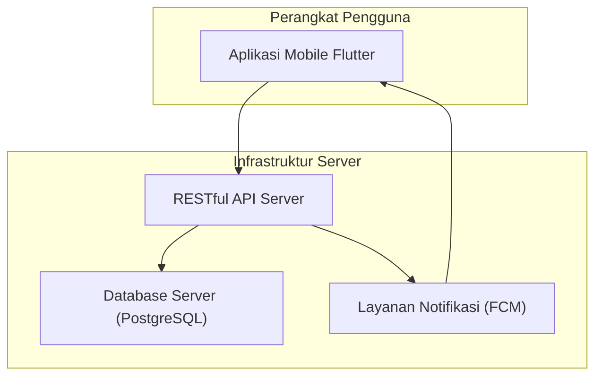

### **Dokumen Desain Perangkat Lunak (SDD): Aplikasi Kantin Multi-Tenant**

*   **Versi:** 1.0
*   **Tanggal:** 17 September 2025
*   **Status:** Final
*   **Penyusun:** Karima

---

### **1. Pendahuluan**

#### **1.1 Tujuan**
Dokumen ini menyediakan desain teknis yang komprehensif untuk Aplikasi Kantin Multi-Tenant. Tujuannya adalah untuk memberikan cetak biru (blueprint) arsitektural dan desain tingkat komponen kepada tim pengembang sebagai panduan implementasi. Dokumen ini adalah terjemahan dari kebutuhan yang didefinisikan dalam SRS v1.0 ke dalam spesifikasi teknis.

#### **1.2 Ruang Lingkup**
Desain ini mencakup tiga komponen utama:
1.  **Aplikasi Klien (Mobile App):** Arsitektur, manajemen state, alur data, dan desain UI untuk aplikasi Flutter.
2.  **Aplikasi Server (Back-end):** Desain API, model data, dan logika bisnis.
3.  **Database:** Desain skema untuk database server dan database lokal (cache).

---

### **2. Arsitektur Sistem Tingkat Tinggi (High-Level)**

Sistem ini akan mengadopsi arsitektur **Klien-Server (Client-Server)**.



*   **Aplikasi Klien (Flutter):** Bertanggung jawab untuk presentasi (UI) dan interaksi pengguna. Aplikasi ini bersifat *stateless* sebisa mungkin, dengan state yang persisten dikelola di server atau di-cache secara lokal.
*   **RESTful API Server:** Bertindak sebagai jembatan antara klien dan database. Ini akan menangani semua logika bisnis, autentikasi, dan otorisasi.
*   **Database Server (PostgreSQL):** Akan menjadi sumber kebenaran tunggal (Single Source of Truth) untuk semua data aplikasi. PostgreSQL dipilih karena keandalan, skalabilitas, dan dukungan fitur yang kuat.
*   **Layanan Notifikasi (FCM - Firebase Cloud Messaging):** Digunakan untuk mengirim notifikasi *push* secara real-time ke perangkat pengguna.

---

### **3. Desain Aplikasi Klien (Front-end - Flutter)**

#### **3.1 Arsitektur: Clean Architecture**
Aplikasi akan distrukturkan mengikuti prinsip **Clean Architecture** untuk memisahkan logika bisnis dari detail implementasi (UI, database, dll.), sehingga menghasilkan kode yang mudah diuji, dipelihara, dan independen.

Lapisan-lapisan utama adalah:
1.  **Presentation Layer:** Bertanggung jawab atas semua yang berhubungan dengan UI.
    *   **Komponen:** Widget Flutter, Halaman (Screens).
    *   **Manajemen State:** Menggunakan **Riverpod** untuk mengelola state UI dan menghubungkan UI ke lapisan di bawahnya.
    *   **Navigasi:** Menggunakan **GoRouter** untuk manajemen rute yang terstruktur.
2.  **Domain Layer:** Inti dari aplikasi. Berisi logika bisnis murni.
    *   **Komponen:** *Entities* (model data, dibuat dengan **Freezed**), *Use Cases* (kasus penggunaan/fitur), dan *Repository Interfaces* (kontrak untuk sumber data).
    *   **Ketergantungan:** Lapisan ini **tidak bergantung** pada lapisan lain.
3.  **Data Layer:** Bertanggung jawab untuk menyediakan data ke Domain Layer.
    *   **Komponen:** Implementasi *Repository*, *Data Sources* (Remote/API & Local/Database), dan DTO (Data Transfer Objects).
    *   **Sumber Data Remote:** Menggunakan `http` atau `dio` untuk berkomunikasi dengan REST API.
    *   **Sumber Data Lokal:** Menggunakan **Drift** sebagai ORM di atas SQLite untuk caching data dan manajemen data offline (seperti keranjang belanja).

#### **3.2 Struktur Direktori Proyek**
Struktur direktori akan diorganisir berdasarkan fitur dan lapisan untuk skalabilitas.
```
lib/
├── features/
│   ├── auth/
│   │   ├── presentation/
│   │   │   ├── providers/
│   │   │   └── screens/
│   │   ├── domain/
│   │   │   ├── models/
│   │   │   ├── repositories/
│   │   │   └── usecases/
│   │   └── data/
│   │       ├── datasources/
│   │       └── repositories/
│   ├── orders/
│   ├── products/
│   └── ... (fitur lainnya)
│
├── core/
│   ├── config/ (routing, themes)
│   ├── error/ (failures, exceptions)
│   ├── network/ (api_client)
│   ├── platform/ (notifikasi)
│   ├── providers/ (provider global)
│   └── usecases/ (base usecase)
│
├── data/
│   ├── local/
│   │   └── app_database.dart (definisi Drift)
│
└── main.dart
```

#### **3.3 Strategi Manajemen State (Riverpod)**
*   **`FutureProvider`:** Digunakan untuk mengambil data yang tidak sering berubah, seperti profil pengguna atau detail produk.
*   **`StreamProvider`:** Digunakan untuk data real-time. Ini akan menjadi tulang punggung untuk fitur pelacakan pesanan (baik untuk Pembeli maupun Tenant) dan daftar pesanan masuk untuk Tenant. Provider ini akan "mendengarkan" stream dari Drift atau WebSocket dari server.
*   **`NotifierProvider` / `StateNotifierProvider`:** Digunakan untuk mengelola state yang kompleks dan memiliki logika bisnis, seperti state keranjang belanja, form input, dan state UI yang interaktif.
*   **`Provider`:** Digunakan untuk menyediakan dependensi yang tidak berubah, seperti instance dari Repository.

#### **3.4 Penanganan Error (FPdart)**
Setiap pemanggilan dari Presentation Layer ke Data Layer akan melalui alur fungsional.
*   Repository pada Data Layer akan mengembalikan `Future<Either<Failure, T>>`.
    *   `Left(Failure)`: Menandakan terjadi kegagalan (misal: `ServerFailure`, `NetworkFailure`).
    *   `Right(T)`: Menandakan operasi berhasil dengan membawa data `T`.
*   Ini menghindari penggunaan `try-catch` di seluruh UI dan memungkinkan penanganan error yang terpusat dan elegan.

---

### **4. Desain Aplikasi Server (Back-end)**

#### **4.1 Arsitektur: RESTful API**
API akan dirancang mengikuti prinsip REST, menggunakan metode HTTP standar (GET, POST, PUT, DELETE) dan mengembalikan respons dalam format JSON.

#### **4.2 Autentikasi & Otorisasi**
*   **Autentikasi:** Menggunakan **JSON Web Tokens (JWT)**. Setelah login berhasil, server akan mengeluarkan *access token* yang akan disimpan di klien.
*   **Otorisasi:** Setiap *endpoint* yang memerlukan proteksi akan memverifikasi JWT yang dikirimkan dalam *Authorization header*. *Middleware* akan digunakan untuk memeriksa peran (`role`) pengguna yang ada di dalam token untuk mengontrol akses ke *endpoint* spesifik (misal, hanya `owner` yang bisa mengakses *endpoint* manajemen tenant).

#### **4.3 Desain Endpoint API (Ringkasan)**

| Metode | Endpoint | Deskripsi | Otorisasi |
| :--- | :--- | :--- | :--- |
| POST | `/api/auth/register` | Mendaftarkan pengguna baru (Pembeli). | Publik |
| POST | `/api/auth/login` | Login untuk semua peran. | Publik |
| POST | `/api/owner/tenants` | Owner membuat akun tenant baru. | Owner |
| GET | `/api/owner/tenants` | Owner melihat semua tenant. | Owner |
| PUT | `/api/owner/tenants/{id}` | Owner mengubah status/data tenant. | Owner |
| GET | `/api/categories` | Melihat semua kategori makanan. | Terautentikasi |
| POST | `/api/categories` | Owner membuat kategori baru. | Owner |
| GET | `/api/tenants/{id}/products`| Melihat semua produk dari satu tenant. | Publik |
| POST | `/api/products` | Tenant menambahkan produk baru. | Tenant |
| PUT | `/api/products/{id}` | Tenant mengubah produknya. | Tenant |
| GET | `/api/orders` | Melihat riwayat pesanan (berdasarkan peran). | Pembeli/Tenant |
| POST | `/api/orders` | Pembeli membuat pesanan baru. | Pembeli |
| PUT | `/api/orders/{id}/status` | Tenant mengubah status pesanan. | Tenant |

---

### **5. Desain Database**

#### **5.1 Database Server**
*   **Sistem Manajemen Database (DBMS):** **PostgreSQL**.
*   **Skema:** Skema yang akan diimplementasikan adalah skema final yang telah didefinisikan dalam dokumen sebelumnya, yang mencakup tabel `users`, `tenants`, `categories`, `products`, `orders`, dan `order_items` dengan relasi yang sesuai.

#### **5.2 Database Lokal (Klien)**
*   **Teknologi:** **SQLite** melalui **Drift ORM**.
*   **Tujuan Penggunaan:**
    1.  **Caching Data:** Menyimpan data yang sering diakses seperti daftar tenant, kategori, dan menu produk untuk mengurangi panggilan jaringan dan mempercepat waktu muat UI. Data akan disinkronkan secara periodik dengan server.
    2.  **Manajemen State Offline:** Menyimpan data yang dibuat di sisi klien sebelum dikirim ke server, contoh utamanya adalah **keranjang belanja**. Tabel `cart_items` akan dibuat di database lokal.

---

### **6. Logging dan Monitoring**
*   **Logging Klien:** Menggunakan package `logger` untuk logging selama development. Untuk rilis, log error dan crash akan dikirim ke layanan seperti Firebase Crashlytics atau Sentry.
*   **Logging Server:** Semua permintaan dan error di sisi server akan dicatat. Metrik kinerja API akan dipantau menggunakan tools monitoring.