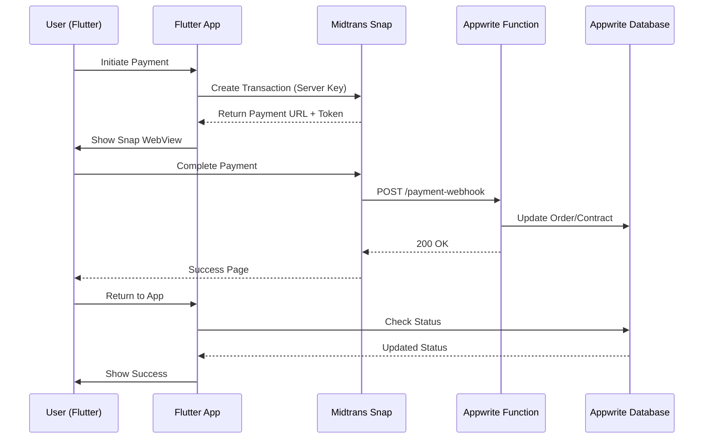

# Payment Integration Plan - Kantin App

**Last Updated:** 5 December 2025  
**Status:** Planning Phase  
**Estimated Implementation Time:** 4-6 days

---

## 📋 Overview

Aplikasi Kantin membutuhkan **Hybrid Payment System** untuk mendukung dua jenis transaksi:

1. **Midtrans Payment Gateway** (Physical Goods & Services)
   - Order makanan/minuman (Guest)
   - Perpanjang kontrak Business Owner/Tenant
   
2. **Google Play Billing** (Digital Goods - Future Phase)
   - Subscription VIP/Premium features
   - Unlock fitur laporan penjualan
   - Unlimited tenant creation

---

## 🎯 Implementation Strategy

### Phase 1: Midtrans Integration (Priority: CRITICAL)
**Timeline:** 3-4 days  
**Status:** Ready to implement

### Phase 2: Google Play Billing (Priority: FUTURE)
**Timeline:** 2-3 days  
**Status:** After market validation

---

## 🏗️ Architecture Design

### Midtrans Payment Flow



---

## 📦 Phase 1: Midtrans Integration

### 1.1. Prerequisites

#### Midtrans Account Setup
1. Register at [Midtrans Dashboard](https://dashboard.midtrans.com/)
2. Complete business verification (KTP, NPWP for Indonesia)
3. Get credentials:
   - **Server Key** (for backend/Appwrite Function)
   - **Client Key** (for Flutter app)
4. Configure webhook URL in Midtrans Dashboard

#### Appwrite Function Slot
- **Used:** 4/5 functions
- **Available:** 1 slot remaining
- **Will Use:** `payment-gateway` function

---

### 1.2. Appwrite Function: `payment-gateway`

**Function ID:** `payment-gateway`  
**Runtime:** Node.js 18  
**Trigger:** HTTP (Webhook from Midtrans)

#### Environment Variables
```env
MIDTRANS_SERVER_KEY=your_server_key_here
MIDTRANS_IS_PRODUCTION=false  # true for production
DATABASE_ID=kantin-db
ORDERS_COLLECTION_ID=orders
USERS_COLLECTION_ID=users
```

#### Functionality
- **Endpoint:** POST `/payment-gateway`
- **Input:** Midtrans webhook payload (JSON)
- **Responsibilities:**
  1. Verify signature dari Midtrans (security)
  2. Parse transaction data
  3. Identify transaction type (`ORDER_PAYMENT` or `EXTEND_CONTRACT`)
  4. Update database accordingly:
     - **Order:** Update status dari `pending_payment` → `processing`
     - **Contract:** Tambah 30 hari ke `contract_end_date`
  5. Send notification (optional - via Appwrite Messaging)

#### Code Structure (Pseudocode)
```javascript
export default async ({ req, res, log, error }) => {
  // 1. Verify Midtrans signature
  const isValid = verifySignature(req.body, req.headers);
  if (!isValid) return res.json({ error: 'Invalid signature' }, 401);

  // 2. Parse payload
  const { order_id, transaction_status, custom_field } = req.body;
  const { type, id } = JSON.parse(custom_field);

  // 3. Handle based on type
  if (type === 'ORDER_PAYMENT') {
    if (transaction_status === 'settlement') {
      await updateOrderStatus(id, 'processing');
    }
  } else if (type === 'EXTEND_CONTRACT') {
    if (transaction_status === 'settlement') {
      await extendContract(id, 30); // Add 30 days
    }
  }

  return res.json({ success: true }, 200);
};
```

---

### 1.3. Flutter Client Integration

#### Dependencies (pubspec.yaml)
```yaml
dependencies:
  midtrans_sdk: ^0.2.0  # Official Midtrans Flutter SDK
  webview_flutter: ^4.4.0  # For Snap payment page
  http: ^1.1.0  # For API calls
```

#### Payment Service (Flutter)
**File:** `lib/core/services/payment_service.dart`

```dart
class PaymentService {
  final String clientKey;
  final bool isProduction;

  // Create transaction for order
  Future<String> createOrderPayment({
    required String orderId,
    required int amount,
    required String customerName,
  }) async {
    // Call Midtrans Snap API
    final snapToken = await _createSnapToken(
      orderId: orderId,
      amount: amount,
      itemDetails: [...],
      customField: {'type': 'ORDER_PAYMENT', 'id': orderId},
    );
    return snapToken;
  }

  // Create transaction for contract extension
  Future<String> createContractPayment({
    required String userId,
    required int months,
  }) async {
    final amount = months * 50000; // Rp 50k per month
    final snapToken = await _createSnapToken(
      orderId: 'CONTRACT_${userId}_${DateTime.now().millisecondsSinceEpoch}',
      amount: amount,
      itemDetails: [
        {'id': 'contract', 'name': 'Perpanjang Kontrak $months Bulan', 'price': amount, 'quantity': 1}
      ],
      customField: {'type': 'EXTEND_CONTRACT', 'id': userId},
    );
    return snapToken;
  }

  // Show Snap payment page
  Future<bool> showPaymentPage(BuildContext context, String snapToken) async {
    // Open WebView with Snap URL
    final result = await Navigator.push(
      context,
      MaterialPageRoute(
        builder: (context) => MidtransPaymentPage(snapToken: snapToken),
      ),
    );
    return result == 'success';
  }
}
```

---

### 1.4. UI Integration Points

#### A. Guest Checkout Page
**File:** `lib/features/guest/presentation/pages/checkout_page.dart`

**Changes:**
1. Add "Bayar Sekarang" button
2. Call `PaymentService.createOrderPayment()`
3. Show Snap WebView
4. Handle payment result:
   - Success: Navigate to Order Tracking
   - Pending: Show "Menunggu Pembayaran"
   - Failed: Show error

#### B. Business Owner - Perpanjang Kontrak
**File:** `lib/features/business_owner/presentation/pages/tenant_contracts_page.dart`

**Changes:**
1. Add "Perpanjang Kontrak" button next to each tenant
2. Show dialog: "Perpanjang berapa bulan? (1/3/6/12)"
3. Call `PaymentService.createContractPayment()`
4. Show Snap WebView
5. Handle payment result

#### C. Tenant - Perpanjang Kontrak Sendiri
**File:** `lib/features/tenant/presentation/tenant_dashboard.dart`

**Changes:**
1. Add "Perpanjang Kontrak" button di contract warning banner
2. Similar flow seperti Business Owner

---

### 1.5. Database Schema Updates

#### Orders Collection
**New Field:**
- `payment_status`: String (enum: `pending`, `paid`, `failed`, `expired`)
- `snap_token`: String? (untuk tracking)
- `midtrans_order_id`: String?

#### Users Collection (No changes needed)
- `contract_end_date` sudah ada, tinggal update saja

---

### 1.6. Testing Strategy

#### Unit Testing
- Test Appwrite function with mock Midtrans payload
- Test signature verification

#### Integration Testing
1. **Sandbox Mode:**
   - Use Midtrans sandbox credentials
   - Test credit card: `4811 1111 1111 1114`
   - Test GoPay, QRIS in sandbox

2. **Test Scenarios:**
   - ✅ Order payment success → Status updated
   - ✅ Contract payment success → Date extended
   - ❌ Payment failed → Status remains pending
   - ❌ Invalid signature → Rejected

#### Manual Testing
1. Complete order flow dari Guest
2. Perpanjang kontrak sebagai Business Owner
3. Auto-cleanup tetap jalan jika kontrak expired

---

## 📦 Phase 2: Google Play Billing (Future)

### 2.1. Prerequisites

#### Google Play Console Setup
1. **Register:** [Google Play Console](https://play.google.com/console)
   - Cost: $25 USD (one-time)
   - Verification: 1-2 hari
   
2. **Create Subscription Products:**
   - Product ID: `vip_monthly`
   - Price: Rp 50.000/bulan
   - Benefits: Unlimited tenants + Laporan penjualan

3. **Setup Testing:**
   - Add test email accounts
   - Use test credit cards

---

### 2.2. Flutter Integration

#### Dependencies
```yaml
dependencies:
  in_app_purchase: ^3.1.11  # Official Google/Apple IAP plugin
```

#### Premium Service (Flutter)
**File:** `lib/core/services/premium_service.dart`

```dart
class PremiumService {
  final InAppPurchase _iap = InAppPurchase.instance;

  // Check if user has active subscription
  Future<bool> isPremium(String userId) async {
    // Check from Database first (cache)
    final user = await getUser(userId);
    if (user.isPremium && user.premiumExpiryDate.isAfter(DateTime.now())) {
      return true;
    }

    // Verify with Google Play
    final purchases = await _iap.restorePurchases();
    // Update database if active
    return false;
  }

  // Purchase VIP subscription
  Future<bool> purchasePremium() async {
    const productId = 'vip_monthly';
    final products = await _iap.queryProductDetails({productId});
    
    if (products.notFoundIDs.isNotEmpty) {
      throw Exception('Product not found');
    }

    final purchaseParam = PurchaseParam(productDetails: products.productDetails.first);
    final success = await _iap.buyNonConsumable(purchaseParam: purchaseParam);
    
    return success;
  }

  // Listen to purchase updates
  void listenToPurchases() {
    _iap.purchaseStream.listen((purchases) {
      for (final purchase in purchases) {
        if (purchase.status == PurchaseStatus.purchased) {
          // Update database: set is_premium = true
          _verifyAndUpdatePremium(purchase);
        }
      }
    });
  }
}
```

---

### 2.3. Database Schema (Premium)

#### Users Collection
**New Fields:**
- `is_premium`: Boolean (default: false)
- `premium_started_at`: DateTime?
- `premium_expires_at`: DateTime?
- `google_purchase_token`: String? (for verification)

---

### 2.4. Feature Gating

#### Unlimited Tenants
**File:** `lib/features/business_owner/presentation/tenant_management_page.dart`

```dart
Future<void> _handleAddTenant() async {
  final isPremium = await ref.read(premiumServiceProvider).isPremium(user.id);
  final tenantCount = tenants.length;

  if (!isPremium && tenantCount >= 3) {
    // Show upgrade dialog
    showDialog(
      context: context,
      builder: (context) => UpgradeToPremiumDialog(),
    );
    return;
  }

  // Proceed to add tenant
  _showAddTenantDialog();
}
```

#### Laporan Penjualan
**File:** `lib/features/business_owner/presentation/business_owner_dashboard.dart`

```dart
_buildMenuCard(
  icon: Icons.analytics,
  title: 'Laporan Penjualan',
  badge: isPremium ? null : 'VIP',
  onTap: () async {
    final isPremium = await checkPremium();
    if (!isPremium) {
      showUpgradeDialog();
      return;
    }
    Navigator.push(...);
  },
)
```

---

## 💰 Cost Breakdown

| Item | Cost | Notes |
|------|------|-------|
| **Phase 1: Midtrans** | | |
| Midtrans Account | GRATIS | Bayar fee transaksi saja |
| Transaction Fee | 2-3% per transaksi | Standard rate |
| Development Time | 3-4 hari | Internal cost |
| **Phase 2: Google Play** | | |
| Google Play Console | $25 (~Rp 395k) | One-time |
| Transaction Fee | 15% per subscription | Google's cut |
| Development Time | 2-3 hari | Internal cost |

---

## 📊 Success Metrics

### Phase 1 (Midtrans)
- [ ] 100% order payments successful
- [ ] Average payment time < 2 menit
- [ ] Contract extension automation works
- [ ] Zero failed webhooks

### Phase 2 (Google Play)
- [ ] VIP conversion rate > 5%
- [ ] Subscription retention > 80%
- [ ] Zero payment disputes

---

## 🚀 Deployment Checklist

### Before Going Live
- [ ] Midtrans production credentials activated
- [ ] Webhook URL configured di Midtrans Dashboard
- [ ] SSL certificate active (HTTPS required)
- [ ] Test all payment methods (QRIS, GoPay, Bank Transfer)
- [ ] Monitor Appwrite function logs
- [ ] Setup error alerting (email/Slack)

### Production Monitoring
- [ ] Daily check Midtrans Dashboard
- [ ] Monitor Appwrite function success rate
- [ ] Check for stuck orders (`pending_payment` > 24 jam)
- [ ] Review contract extension accuracy

---

## 📚 External Resources

### Midtrans
- [Official Documentation](https://docs.midtrans.com/)
- [Snap Integration Guide](https://docs.midtrans.com/docs/snap-integration-guide)
- [Webhook Notification](https://docs.midtrans.com/docs/http-notification-webhooks)
- [Flutter SDK](https://pub.dev/packages/midtrans_sdk)

### Google Play Billing
- [In-App Purchase Documentation](https://developer.android.com/google/play/billing)
- [Flutter Plugin](https://pub.dev/packages/in_app_purchase)
- [Testing Guide](https://developer.android.com/google/play/billing/test)

### Appwrite
- [Functions Documentation](https://appwrite.io/docs/functions)
- [Environment Variables](https://appwrite.io/docs/functions#environment-variables)

---

**Next Steps:**
1. Review this plan with stakeholders
2. Setup Midtrans account (sandbox first)
3. Implement Phase 1 (Midtrans)
4. Test thoroughly in sandbox
5. Deploy to production
6. Monitor for 1-2 weeks
7. Evaluate Phase 2 (Google Play Billing) based on user feedback

**Questions? Update this document as implementation progresses.**
